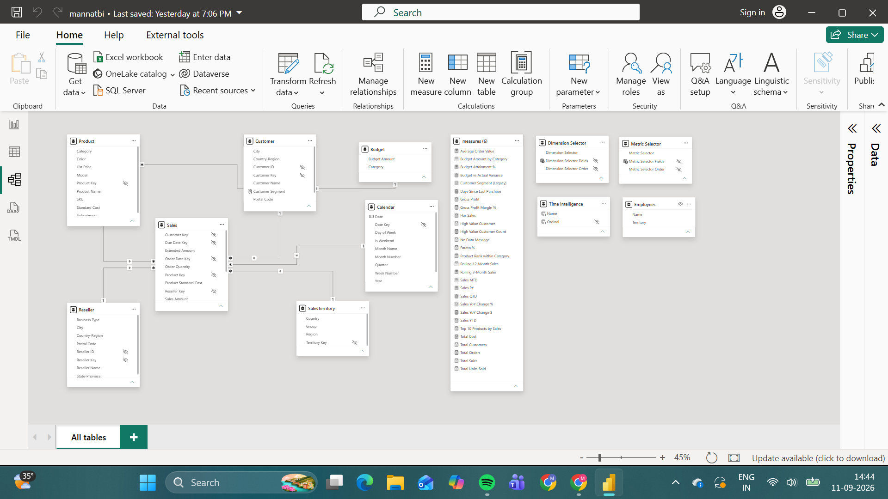

# AdventureWorks Power BI Data Analytics

## What this is

This is my AdventureWorks Power BI project - a 4-week build covering data modelling, DAX, Power Query, report design, and enterprise features like RLS and performance tuning. I built a star schema, wrote 28 DAX measures, put together a 5-page report with calculation groups and field parameters, set up row-level security, and did a performance pass with Power Query cleanup at the end.

- File: `mannatbi.pbix`
- Dataset: AdventureWorks (Microsoft's free sample)
- Tool: Power BI Desktop

## Setup

1. Install Power BI Desktop (free from Microsoft).
2. Clone this repo.
3. Open `mannatbi.pbix`.
4. It'll ask to refresh data on first open - let it load.
5. To check row-level security, go to Modeling → View As and pick one of the three roles.
6. The Dynamic Employee Territory role uses `USERPRINCIPALNAME()`, which won't actually return anything in Desktop - it only works once published to the Service with Pro. I documented it but couldn't fully test it locally.

## Model screenshot


## Video walkthrough
*[Loom link goes here]*

---

## Week 1 - Data Loading, Power Query & Data Modelling

Goal was to get the model clean before touching any DAX.

**Tables:** Sales (fact), Product, Customer, Reseller, SalesTerritory, Calendar, SalesOrder (dimensions).

**Relationships**, all 1:* from dimension to fact:
- Customer → Sales on Customer Key
- Product → Sales on Product Key
- Reseller → Sales on Reseller Key
- SalesTerritory → Sales on Sales Territory Key
- Calendar → Sales on Order Date Key
- SalesOrder → Sales on Sales Order Line Key

Star schema, Sales in the middle, everything else around it, single-direction filtering.

Validated with a basic measure:
```DAX
Total Sales = SUM(Sales[Sales Amount])
```

---

## Week 2 - DAX Measures, Time Intelligence & Advanced Calculations

Target was 25+ measures. Ended up with 28, all in a dedicated Measures table.

Note: there's no Returns table in this dataset, so Total Returns and Return Rate % from the original plan just aren't buildable here - I skipped them rather than fake something.

**Foundation**
- Total Sales - `SUM(Sales[Sales Amount])`
- Total Cost - `SUM(Sales[Total Product Cost])`
- Gross Profit - `[Total Sales] - [Total Cost]`
- Gross Profit Margin % (VAR) - `VAR TotalSalesAmt = [Total Sales] VAR TotalGrossProfit = [Gross Profit] RETURN DIVIDE(TotalGrossProfit, TotalSalesAmt, 0)`
- Total Customers - `DISTINCTCOUNT(Sales[Customer Key])`
- Total Units Sold - `SUM(Sales[Order Quantity])`
- Total Orders - `DISTINCTCOUNT(Sales[Sales Order Line Key])`
- Average Order Value (VAR) - `VAR TotalSalesAmt = [Total Sales] VAR TotalOrderCount = [Total Orders] RETURN DIVIDE(TotalSalesAmt, TotalOrderCount, 0)`

**Time intelligence**
- Sales YTD - `CALCULATE(TOTALYTD([Total Sales], Calendar[Date]), REMOVEFILTERS(Calendar[Year]))`
- Sales PY - `CALCULATE([Total Sales], SAMEPERIODLASTYEAR(Calendar[Date]))`
- Sales YoY Change $ (VAR) - current minus prior, both pulled from the two measures above
- Sales YoY Change % (VAR) - same idea, divided
- Sales MTD - `TOTALMTD([Total Sales], Calendar[Date])`
- Sales QTD - `TOTALQTD([Total Sales], Calendar[Date])`
- Rolling 3-Month Sales / Rolling 12-Month Sales (VAR) - `DATESINPERIOD` going back 3 or 12 months from the max date in context

Tested these in a matrix with Year on rows - PY comes back blank for year one and YoY correctly picks up the prior year everywhere else, so I'm confident these are right.

**Error handling**
Every DIVIDE uses the third-argument fallback (0) instead of wrapping in IFERROR - cleaner and it's the recommended pattern.
- Has Sales (VAR, CALCULATE modifiers) - checks `RELATEDTABLE(Sales)` with `KEEPFILTERS(ALL(...))` to flag whether the current context has any related sales rows.

**TREATAS**
I built a standalone Budget table (Category, Budget Amount) with no real relationship to Product, specifically to practice this.
- Budget Amount by Category - `CALCULATE(SUM(Budget[Budget Amount]), ALL(Budget), TREATAS(VALUES(Product[Category]), Budget[Category]))`
- Budget vs Actual Variance (VAR) - actual minus budget target

**Field parameters**
- Metric Selector - switches between Total Sales / Gross Profit / Total Orders
- Dimension Selector - switches the axis between Category / Region / Country-Region

**Ranking & segmentation**
- Top 10 Products by Sales - RANKX-based, shows value only for top 10
- Product Rank within Category - RANKX filtered to the product's own category
- High Value Customer - flags sales over 50,000
- Customer Segment (Legacy) (VAR) - SWITCH/TRUE tiering into Gold/Silver/Bronze/No Sales. I originally named this just "Customer Segment," but it clashed with a calculated column of the same name I added in Week 3 (more on that below), so I renamed it during Week 4 cleanup. I kept the measure around since it's a decent reference for the VAR/SWITCH pattern, but the calculated column is what actually drives the report now.
- Days Since Last Purchase - date diff from a customer's most recent order to today
- Budget Attainment % - actual vs. budget, as a percentage
- Pareto %:
```DAX
Pareto % =
VAR RunningTotal =
    CALCULATE(
        [Total Sales],
        FILTER(
            ALL(Product[Product Name]),
            RANKX(ALL(Product[Product Name]), [Total Sales]) <=
                RANKX(ALL(Product[Product Name]), CALCULATE([Total Sales], REMOVEFILTERS()))
        )
    )
VAR GrandTotal =
    CALCULATE([Total Sales], ALL(Product))
RETURN
    DIVIDE(RunningTotal, GrandTotal, 0)
```
  Gives the cumulative % of sales contributed by products at or above the current product's rank, for 80/20 analysis. The second RANKX ranks against an unfiltered Total Sales (via REMOVEFILTERS) - I had this wrong in an earlier draft where it was just comparing a rank to itself, which doesn't actually mean anything. Fixed it once I caught the mistake.

**CALCULATE deep dive**
Rewrote three measures with explicit modifiers and commented each one on what the filter context looks like before and after:
- Sales YTD - REMOVEFILTERS(Calendar[Year]) clears the year filter before applying YTD
- Has Sales - KEEPFILTERS + RELATEDTABLE checks related rows without overriding existing filters
- Budget Amount by Category - ALL(Budget) clears prior filters before TREATAS cross-filters from Product

28 measures total. I also had a dead helper measure, Show No Data Message, that I ended up deleting - see the Week 4 cleanup note.

---

## Week 3 - Report Design, UX & Advanced Visuals

Built out a 5-page report.

**Executive Summary** - 5 KPI cards (Total Sales, Gross Profit %, Sales YoY Change %, Total Orders, Total Customers - swapped Return Rate % out since there's no Returns table), a monthly sales line chart with a prior-year comparison line (sorted by Month Number since Month Name alone sorts alphabetically), and a Sales by Territory bar chart across all 10 regions. Added a Page Navigator and built a mobile layout for this page.

**Calculation groups** - Built a Time Intelligence calc group in Tabular Editor 3 with six items: Current Period, Prior Year, YoY Change $, YoY Change %, YTD, MTD. Each wraps `SELECTEDMEASURE()` with the relevant pattern. The point of doing this instead of writing separate YTD/PY/YoY measures for every metric is that one slicer now flips the time-period behaviour for every measure on the page at once - way less duplicated logic to maintain. Applied it to Sales Analysis and the Tooltip page.

**Sales Analysis page** - Matrix of Category/Subcategory against Total Sales, Gross Profit, Sales YoY Change %, Gross Profit Margin %. Reading the plan literally, the field parameters don't replace the matrix's own columns - they drive a separate clustered column chart instead, letting users flip its metric and axis. The calc group slicer sits on the matrix so all six time-period views work across every value at once. Conditional formatting: red/green gradient on YoY %, threshold colours on Gross Profit Margin % (red under 20%, yellow 20–40%, green 40%+).

**Conditional visibility**, two patterns here:
1. Bar/line toggle for the Total Sales by Category chart - two versions stacked via the Selection Pane, two bookmarks ("Show Bar"/"Show Line") grouped separately from page-nav bookmarks so they don't interfere, wired to a Switch View button.
2. A measure-driven empty state - used a Card instead of a text box (text boxes don't support visual-level filtering here) bound to:
```DAX
No Data Message = IF(ISBLANK([Total Sales]), "No data available for the selected filters", BLANK())
```
This one gave me trouble at first - kept throwing "Error fetching data for this visual." Turned out the calc group slicer on the same page was cross-filtering the text measure, since its calculation items try numeric operations on `SELECTEDMEASURE()` and that breaks on text output. Fixed by locking the Card's context to Current Period.

I also tried a second approach here early on - a `Show No Data Message` measure returning 1/0 instead of text, meant to drive visual-level filtering. It never actually worked the way I wanted, so I dropped it in favour of the Card above, and deleted the measure outright during Week 4 cleanup rather than leave dead code sitting in the model.

**Customer Analysis page** - Top 20 customers table (name, segment, days since last purchase, total sales), Sales by Customer Segment bar chart, Sales by Country-Region/City treemap, High Value Customer count card, plus segment and date-range slicers.

A few bugs I ran into here:
- Days Since Last Purchase was originally comparing against `Sales[Order Date Key]`, which is a numeric surrogate key, not an actual date - errored out. Fixed by going through `Calendar[Date]` instead.
- Customer Segment started as a measure, which meant it couldn't go on a chart axis (axes need columns). First attempt at converting it to a calculated column used ALLEXCEPT and returned "Gold" for literally everyone - wrong. Rebuilt it as a calculated column using plain `CALCULATE([Total Sales])`, relying on normal relationship context transition instead. Kept the original measure around as a reference for the VAR/SWITCH pattern from Week 2, but renamed it to Customer Segment (Legacy) during Week 4 cleanup once I realized the name clash was going to cause confusion - the calculated column is what the report actually uses.
- High Value Customer Count kept returning 1 when it should've been higher or at least made sense - turned out the one row crossing the 50,000 threshold was the "[Not Applicable]" customer, not a real one (real customers top out around ₹15–17K). Rewrote the measure to explicitly exclude that row and only count Silver/Gold segments. It now correctly shows 0 - meaning no real customer in this dataset currently qualifies as Silver or Gold, which I flagged as a finding in the Week 4 insights summary.

**Product Detail drill-through page** - hidden 5th page, drill-through on Product Name, shows three KPI cards, a monthly trend line, and an orders table.

**Tooltip page** - custom tooltip locked to Current Period so it's consistent no matter what time-period toggle is active elsewhere on the report; wired to the Sales Analysis line chart and matrix.

**Navigation** - Page Navigator added to the four visible pages, legacy test pages and Product Detail hidden from it since Product Detail should only be reached via drill-through.

**QA** - went through every slicer, drill-through, bookmark, tooltip, field parameter, and calc group toggle. Everything checked out.

---

## Week 4 - Security, Performance, Documentation & Presentation

**Static RLS** - three roles filtering SalesTerritory[Group]: North America Manager, Europe Manager, Pacific Manager. Tested each with View As Roles - restricts everything correctly, no leakage between territories.

**Dynamic RLS** - built an Employees table (Name, Territory) with no formal relationship to anything, and a Dynamic Employee Territory role:
```DAX
[Group] = LOOKUPVALUE(Employees[Territory], Employees[Name], USERPRINCIPALNAME())
```
Can't actually test this in Desktop since USERPRINCIPALNAME() only resolves once published to the Service under Pro - documented rather than verified.

**Performance Analyser** - ran it on the Sales Analysis page. Cold cache, the three slowest visuals were two slicers (~7000ms each), the Matrix (7675ms), and a Card (7013ms). Looking closer, the actual DAX query time was tiny (15–65ms) - almost all the time was rendering overhead on first load, logged as "Other." Warm cache brought the slicers down to 560–2000ms, but the Matrix stayed the slowest at around 3000ms even warm.

I fixed the Matrix by dropping Gross Profit Margin % - it was carrying four calc-group-driven measures, and cutting one column brought the duration down from 7675ms to about 726–927ms, roughly an 8x improvement. Takeaway: every extra calc-group measure on a visual adds real rendering cost, and trimming columns is a cheap, low-risk fix.

**Power Query** - merged Product and Budget, with Product as the base query and Budget's Budget Amount pulled in via a Left Outer join on Category. My first attempt had this backwards - I merged Product into Budget instead, which duplicated Budget's rows (since lots of products share one category) and broke the row uniqueness that the Week 2 TREATAS measure depends on. Redid it the other way around and it's fine now - Product's row count stays at 397, unduplicated, and Budget's structure is untouched.

Also added a Budget Status custom column in M:
```
if [Budget Amount] > 10000000 then "High Budget" else "Standard Budget"
```
Did this in Power Query rather than DAX because it's a one-time structural label, not something that needs to react to slicers - no point recalculating it on every interaction when Power Query can just bake it in at refresh.

**Model cleanup** - two things I cleaned up this week:
- Renamed the Customer Segment measure to Customer Segment (Legacy) to stop it clashing with the calculated column of the same name.
- Deleted the Show No Data Message measure - it was a failed alternative approach from Week 3 that never worked and was just sitting there unused.

28 measures total in the model now.

**Business insights summary** - wrote up 5 findings with real numbers from the report, 3 recommendations, and 2 things I'd want to dig into further with more data. See [business-insights-summary.pdf](business-insights-summary.pdf).

**Data dictionary** - every table, every column (type + what it means), and every measure with its exact formula, checked directly against the live .pbix rather than assumed from this README. See [data-dictionary.pdf](data-dictionary.pdf).

**Video walkthrough** - link above once recorded.

**Self-assessment** - see [self-assessment.pdf](self-assessment.pdf) - skill ratings (Beginner / Developing / Proficient / Strong) per area, plus a reflection on the hardest part of the build.
